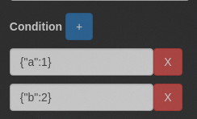
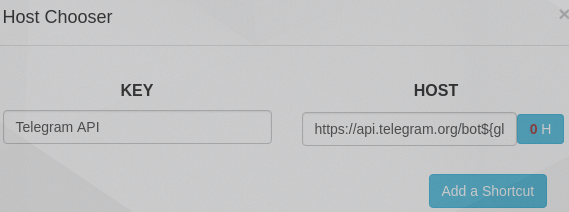
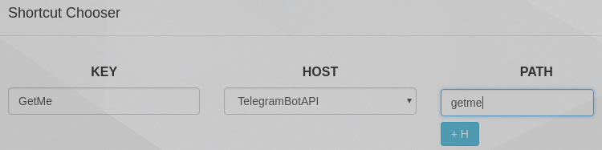
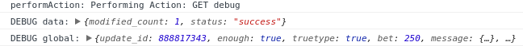

## State variables
There are two session state variables: `global` and `data`. Type is JavaScript dict.

`global` context in fact, contains global data of session, you can use it for storing some variables using `js` method (see below).

`data` contains result of prev node, when you use `js` you can change it value too.

##### Usage
In Request data: `{"some_field": "${data.some_var}"}` (`global` same)

In `js` method: `{"code": "data.some_var"}` - so, use it as is (`global` same)

#### Escaping
`${data.a}` is escaping for `a` variable from `data` (`global` same).

Internally it's transformed to value of `data.a`.

#### Type casting
`${"key:type": "value"}` -> then "value" will be tried to be casted to `type`.

`Type` can be: `number`, `string`, `boolean`, `null`, `object`, `array`. If type not specified - cast to string.

Example:
`${"user_id:number":"-123123123"}` -> `{"user_id": -123123123}`

**So, if you have some number in strings, you don't need to cast them in JavaScript before sending to API - just use type casting :)**

## Conditions
In conditions you can check if `data`or `global` variables match JSON written in conditions field, if yes - condition is **True**, otherwise - **False**.

E.g. if condition is `{"key": {"key2": "value"}}` and data or global object has `{"key": {"key2": "value"}}` (e.g. `data={"key": {"key2": "value", ...}, ...}`) - it will be **True**, otherwise **False**.

But not only exact equality gives **True** - see below.

Firstly is checking if var equals condition exactly. If no and value of var dict is integer, this number is casting in string and then other variants of conditions are checking.

First checks `data`, if not - checks `global`.

You can use many conditions in one in AND mode: `cond1` AND `cond2` AND `cond3` will be simply `{cond1, cond2, cond3} `

where `condN` - is usual condition, e.g., `{"key": "value"}`

You can use OR for conditions by creating multiply conditions like

You can use regexp in condition: `{"key": "!REGEXP_MODE!YOUR_REGEXP"}`, 

where

`REGEXP_MODE`:
- `rs` - simple searching and matching regexp
- `rf` - full string pattern matching regexp
- `ra` - pattern matching regexp and set match objects in data

`YOUR_REGEXP` - regexp, like `^a.*[^\d]`

You can check if some keys exist in var: `{"!hasKey!": "key.subkey1"}` will match var `{"key":"subkey1": {"whatever": "whatever"}}`

Also you can check keys in objects from array:
`{"!hasKey!": "some_array.$.key1"}` - match `{"some_array": [{"key1": 1}, {"key2": 2}]}`, so if key "key1" exist in at least one element of array this is match. "some_array.$" will match if "some_array" is array.

`{"!hasKey!": "some_array.0.key1"}` - match `{"some_array": [{"key1": 1}, {"key2": 2}]}`, but does't match `{"some_array": [{"key2": 2}, {"key1": 1}]}`, so 0 here is index of the element (indexes start from 0), negative indexes are also supported, e.g. -1 - index of last element of array, -2 - second from end etc. "some_array.2" will match if array "some_array" has 3rd element.

## Debug
### Executions logs
You can see logs of your bot's execution in Developer's Console of your browser: press F12 and click Console tab. One log for all users for now.

Also you can create special Debug node to print out `data` and `global` objects, for this purpose use **debug** methods (see below in methods section).
#### Storage
There is Storage button in top right corner, click it and you will see all collections from all your bots. Note that two bots can have same collection, so don't use same names of collections if you want to distinct it, e.g. *users* is popular collection, so for bot A you need call it something like *usersA*, for bot B - *usersB*.

For see values of collections just click on names. For get updates - reload page.

**TODO**: Live updates, editing and more flexible presentation.

## Using remote API
You can use remote API: GET, POST, PUT, PUTCH, DELETE Http methods and custom headers, input and result data format is JSON. For convenience there are host aliases and URL shortcuts.
### Host Aliases
You can use aliases for hosts of remote API in top left of editing node panel, e.g.

Note, that you add headers for those hosts, if needed.
Also you can use your global vars in part of host address, it very useful e.g. for apiKeys. On screen above host is 
`https://api.telegram.org/bot${global.apiKey}/` and `global.apiKey` is defined in the first node of the graph.

### URL Shortcuts
You can create URL shortcuts for remote API in top left of editing node panel, e.g.

**Key** is your name for API method, like GetMe, choose it on your test

**Host** is your host alias from drop down list

**Path** is part of API call after host, is example above its is getme, so full API call path is `https://api.telegram.org/bot${global.apiKey}/getme`

## Wait
You can set node to pause, by clicking **Wait** button in bottom of editor, so bot will wait unlimited time, until any update, then resume work and look for next nodes. After resuming `data` will contain data of update, that resumed bot, not result of waiting node.

Wait is not supported for Telegram channels updates (new posts and its editings): if node with wait will get update from channel, then error `"Error! Node <NodeName>. Wait is not supported, so we just go to next Node!"` will be printed in Debug Console and bot's work will be ended.

## Methods (URLs)
#### [goback]
TBD
#### [StartFSM]
TBD
#### [SendMessage]
Send message to social. 

#### Currently supported only Telegram.

##### Input:
`{"text": "This is text of Message", "chat_id": "${global.message.from.id}"}`

#### [js] https://gitlab.com/omw/megafsm/tree/master/mega-fsm/meganodes/megafsm.py/
Execute JavaScript code on isolated server, that can manipulate with your `global`, `data` vars.
So, you can simply use and change them.
##### Input:
Use POST method. Data:
`{"code": "your js code here"}`

Example:

Value `global.a` is  `5`. 

Then we execute `js` node with such Request data: `{"code": "global.b=global.a*2"}`

And in next node `global.b` value is `10`. 

So, we just create new field `b` in `global` dict and assign it value to `global.a` value multiplied by 2.

#### [timeout]
Wait for `s` seconds.
##### Input:
Use POST method. Data:
`{"s": <integer seconds>}`, e.g. `{"s": 5}` - wait for 5 seconds. 

Max time is 10 seconds, min - 0.

##### Output:
On success: `{"status": "success", "message": "Slept well for <s> seconds"}`

On Error: `{"status": "error", "message": ErrorMsg}`

#### [debug]
Print `data` and `global` objects to Developer's Console.
##### Input:
Use GET or POST method. Empty Data.

##### Output:
Like this

### DB methods
There are mongoDB functions for work with JSON data.

Use DocumentId as `_id` - type string, not `ObjectId` (internaly it stored as usually in mondoDB as `ObjectId("574345b6f912481557b96019")`, but you can use this simply as string `"574345b6f912481557b96019"`) . 
Input method is POST. 
Output will stored id `data`.

#### [ReadDB]
##### Input:
`{"collection": CollectionName, "query": MongoFindQuery, "projection:" MongoProjectionQuery,["sort": SortQuery], ["limit": int]}`

where

`MongoFindQuery` - optional, `{"some_field1": "some_value1", ...}`

`SortQuery` -  optional, standart Mongo sort query, but written as dict, not list of tuples, e.g. `{"_d": 1, "name": -1}`
##### Output:
On success: `{"status": "success", "data": ArrayOfDocuments, "found_count": int}`

On Error: `{"status": "error", "message": ErrorMsg}`

See: https://docs.mongodb.com/getting-started/python/query/

#### [CountDB]
Return count of documents in the collection

##### Input:
`{"collection": CollectionName, "query": MongoFindQuery}`

where

`MongoFindQuery` - optional, `{"some_field1": "some_value1", ...}`, if not specified - return count of all documents in the collection

##### Output:
On success: `{"status": "success", "count": int}`

On Error: `{"status": "error", "message": ErrorMsg}`

See: https://docs.mongodb.com/manual/reference/method/db.collection.count/
#### [WriteDB]
##### Input:
`{"collection": CollectionName, "query": Documents}`

where

`Documents` - one or array of Documents (JSON objects)
##### Output:
On success: `{"status": "success", "inserted_ids": inserted_ids}`

`inserted_ids` - list of inserted _ids

On Error: `{"status": "error", "message": ErrorMsg}`

See: https://docs.mongodb.com/getting-started/python/insert/
#### [UpdateDB]
Update specilic fields of Documents, for full replace see ReplaceDB below.

##### Input:
`{"collection": CollectionName, "query": MongoUpdateQuery, "upsert": Boolean, "many": Boolean}`

where 

`MongoUpdateQuery` - `[filter, update]`

`filter` - `{"some_field1": "some_value1", ...}` - find all Documents that match this pattern

`update` - `{"$<**OPERATOR**>": {"some_field2": "new_value2", ...}}` - update its value,
**OPERATOR** can be **set**, **int** etc.
*Note that it can't has _id field, otherwise you will get error, because _id is immutable*

`upsert` - update operation either updates matching document(s) or inserts a new document if no matching document exists, default is **False**

`many` - update one or many Documents, if filter matched more then one, default is **False**
##### Output:
On success: `{"status": "success", "modified_count": modified_count}`

`modified_count` - count of updated Documents

On Error: `{"status": "error", "message": ErrorMsg}`

See: https://docs.mongodb.com/getting-started/python/update/#update-specific-fields
#### [ReplaceDB]
##### Input:
Replace entiry Document, except _id field.

`{"collection": CollectionName, "query": MongoReplaceQuery, "upsert": Boolean}`

where 

`MongoReplaceQuery` - `[filter, new_doc]`

`filter` - `{"some_field1": "some_value1", ...}` - find all Documents that match this pattern

`new_doc` - `{"some_field1": "new_value1", ...}` - new Document.
*Note that it can't has _id field, otherwise you will get error, because _id is immutable*

`upsert` - update operation either updates matching document(s) or inserts a new document if no matching document exists, default is **False**
##### Output:
On success: `{"status": "success", "modified_count": modified_count}`

`modified_count` - count of updated Documents

On Error: `{"status": "error", "message": ErrorMsg}`

See: https://docs.mongodb.com/getting-started/python/update/#replace-a-document
#### [DeleteDB]

Delete 
##### Input:
{"collection": CollectionName, "query": MongoUpdateQuery, "many": Boolean}

where

`MongoFindQuery` - `{"some_field1": "some_value1", ...}`

`many` - delete one or many Documents, if filter matched more then one, default is **False**
##### Output:
On success: `{"status": "success", "deleted_count": deleted_count}`

`deleted_count` - count of deleted Documents

On Error: `{"status": "error", "message": ErrorMsg}`

See: https://docs.mongodb.com/getting-started/python/remove/