<!-- SUBTITLE: A quick summary of Draft 2018 -->
<!--// https://docs.google.com/document/d/1JpepRRYAnX0lpNr6QWskam1lQumMG5emCsWesKAyAp8/edit?usp=sharing //-->
# Создание бота
<!--// https://www.youtube.com/watch?v=mWNeWhJe0gU //--> 

В верхнем меню нажимаем на кнопку мои боты 

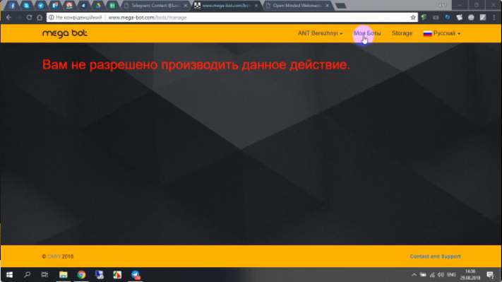

в окне которое открылось нажимаем в левой части интерфейса на кнопку создать 

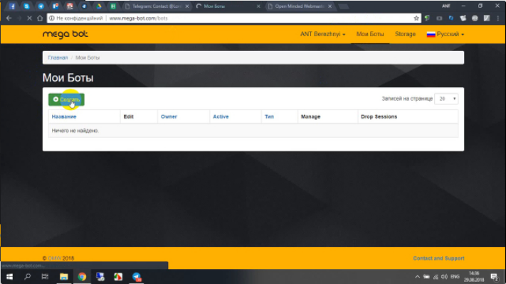

В окне которое открылась  в поле название вводим название бота - это-то название которое будет отображаться у нас 

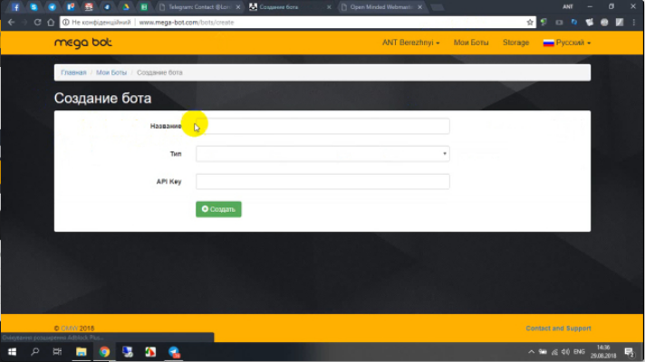

в поле API кей  вводим ключ который получили от @BotFather 
https://t.me/BotFather 

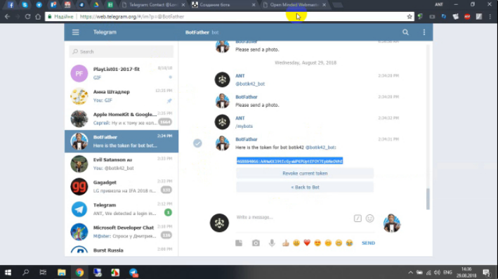

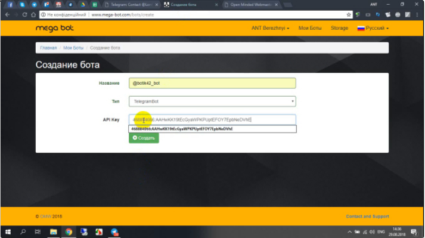 

После чего нажимаем кнопку “создать”

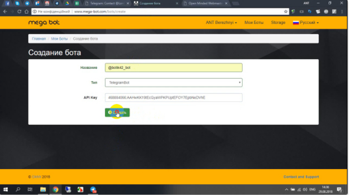

После того когда Наш бот создан,  он появляется в списке ботов,  тем названием (именем) которое мы ему дали. 

После чего нажимаем кнопку во втором столбце “Design Robot” Которая отправить нас на панель редактирование функционала логики бота

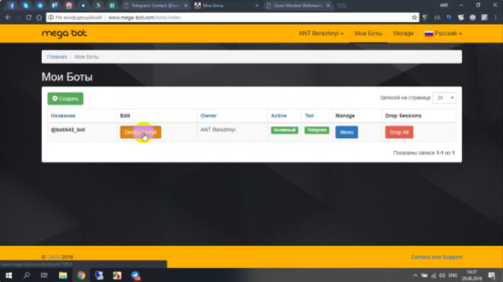

По умолчанию в редакторе у нас уже есть три ноды
* Initial Node
* Set API Key
* Hello

Редактор собой представляет графический конструктор конечных автоматов 
* граф
* вершины
* ребра

 в нашей системе Вершины называются - узлами ( или же в терминологии конечных автоматов состояниями)
 рёбра - переходами ( потому что это стрелка от одного узла к другому узлу)
 
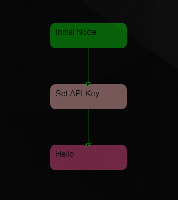 

Есть два вида переходов
*  по условию
*  безусловный

На скриншоте выше видим зелёный узел (noda) (опционально точку входа  при необходимости можно перебросить на другой узел,  редко когда это нужно, но возможно есть).

У этого узла нет другого действия, кроме как начать работу.

Видим что зеленая стрелка идет от зелёного узла к следующему **Set API Key** - это безусловный переход 

Когда приходит сообщение от телеграмма (это некоторый JSON), он попадает сначала зелёный узел, а потом сразу перебрасывается в узел **Set API Key** (что такое узел - Set API Key - рассмотрим позже Link). 

сейчас мы можем сделать простой пример, когда боту нужно поздороваться с пользователем
(в новой версии системы этот узел уже создан по умолчанию, но мы все равно рассмотрим его, на варианте создания узла)

 В правой части интерфейса, есть модальное окно **Controls** (управление), в нижней части которого есть кнопка **Add Node** (добавить узел)
 
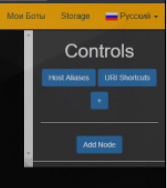 

Нажимаем на кнопку **Add Node**  (добавить узел) 

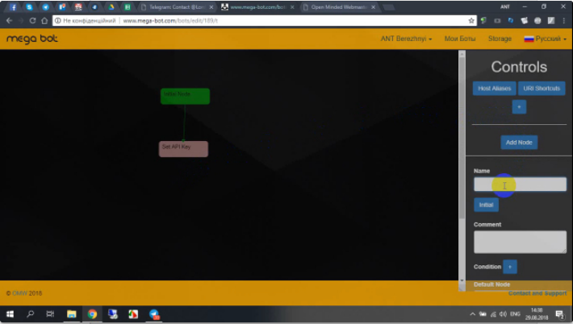 

 в поле **Name** (имя) -  пишем название ноды. Например `Hello - Приветствие`

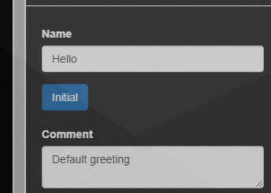 

в поле Comment можно написать комментарий,  к который  в будущем поможет нам понять что именно это надо делает, в данном случае это `Default greeting - Первое приветствие`


Следующий блок **Default Node** (узел по умолчанию) пропускаем, то есть оставляем  значение `None`


 далее переходим к полю **Action** (действие),  днем в нём  выбираем `SendMessage`

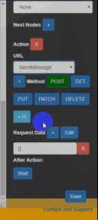

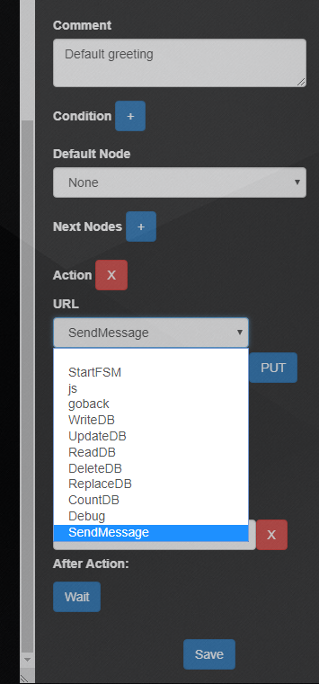 

**SendMessage** -  это непосредственно обращение API Telegram для  отправки сообщений

Какой принцип:
* Каждый узел выполняет одно атомарное действие
* основной принцип (концепция) обращение к внешним API
* также у нас есть внутренний API для разных системных функций
* но это следующая часть...


Ниже  есть поле **Request Data** где мы нажимаем плюсик “**+**”  после чего прописываем JSON,  который полностью соответствует документации телеграма
Чтобы ознакомиться с документацией телеграма, ищите в Гугле *telegram bot api*

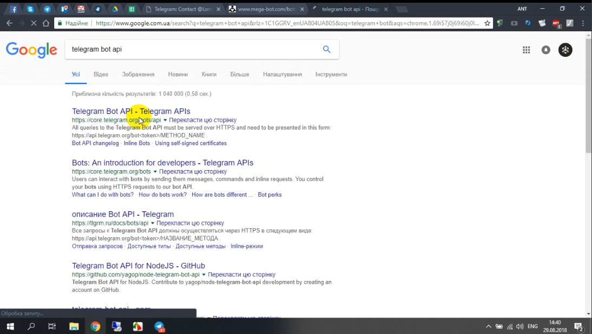

или перейдите по ссылке https://core.telegram.org/bots/api 

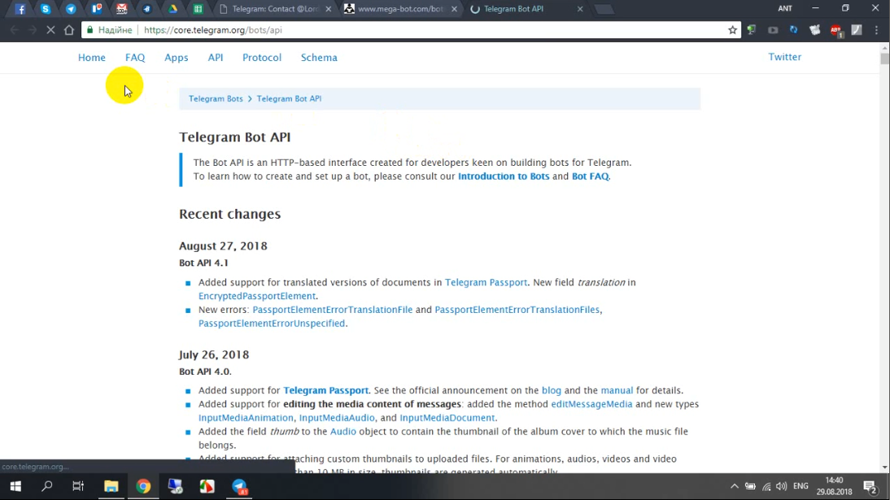

Ищем в правой колонке **Available methods**   
https://core.telegram.org/bots/api#available-methods 

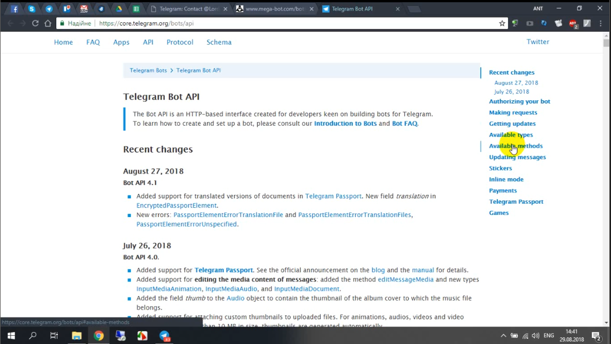

После чего выбираем верхний пункт **sendMessage** 
https://core.telegram.org/bots/api#sendmessage 

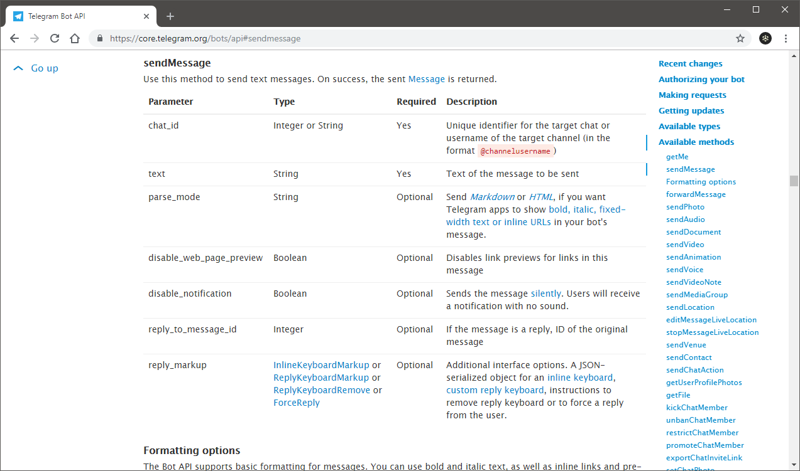


Для референса рассмотрим пример с параметрами **chat_id** и **text**
Эти параметры на данный момент для нас считаются важными,  и на их примере мы будем начинать работать.

Возвращаемся к Мега боту. 
В поле **Request Data** записывается JSON, начинается и заканчивается он фигурными скобками **{** и **}** .

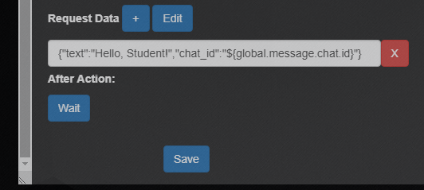

Ключи пишутся в кавычках - **"** , то есть не JS объекты, а именно JSON - в кавычках.
В поле **Request Data** нужно чтобы был следующий JSON 

```text
{"text":"Hello, Student!","chat_id":"${global.message.chat.id}"}
```

В данном примере (и во всём  JSON),  всё что пишется левее от двоеточия является ключами , **text** и **chat_id** 
И просьба запомнить, что **ключи** всегда пишутся в кавычках.
А всё что пишется правее от двоеточия, является параметрами или значение ключа `"Hello, Student!"` и `"${global.message.chat.id}"` 
В некоторых случаях значение ключа могут писаться без кавычек.  Если интересно какие именно - смотрите API Telegram.
https://core.telegram.org/bots/api

Но мы, в нашем случае, обращаемся не к числу а к переменной поэтому,  мы  всегда для такого случая используем кавычки.

`"text":"Hello, Student!"` -  это да фраза которую бот напишет при первом обращении пользователя
 **"text"** и **"Hello, Student!"**  обязательно  нужно писать в кавычках,  между ними двоеточие “**:**”,  Пробелы после кавычек или перед/после двоеточия,  не  являются обязательными и их можно не ставить,  но если сделать ошибку,  пропустить кавычки, поставить лишнее,  или не поставить вообще - JSON поломается и бот не сможет отработать.  Поэтому постоянно нужно быть сосредоточенным на коде.

Для параметра `chat_id` чтобы бот ответил конкретно нам нужно написать:

`"chat_id":"${global.message.chat.id}"`
 Давайте рассмотрим почему именно так. 
В течение сессии у нас есть контекст, контекстные переменные с которыми Мы работаем. 
У верхнего уровня основных переменных всего две: **global** и **data**

**global** - это основной контекст, начнем него. 
Самое первое сообщение которое мы разбудили схему, оно дублируется **global**. Но на самом деле оно находится в **data**.
Это сделано для того чтобы в любое время можно было достать `chat.id` 
Для референса наших переменных, мы используем Знак доллара `$` и фигурные скобки `{}`
Это пишем внутри кавычек `"${global.message.chat.id}"` - Заметьте что кавычки должны быть стандартными, а не угловыми,  и если код  с какого либо сайта, проверяйте, правильно ли они скопировались. В виду того, что если кавычки будут нестандартные, то JSON работать перестанет. 

Дальше вникаем  в то, чем мы дергаем сообщение….
...На самом деле есть `chat.id` и `from.id` -  их нужно различать.  Потому что когда ты общаешься с Ботом в приватном чате, Они одинаковые. Но если Бота подключить в какой-то групповой чат то тогда:
`chat.id` -  идентификатор  чата
`from.id` -  идентификатор того кто написал
На данном этапе мы рекомендуем брать `chat.id`  в связи с тем, что это более универсальное решение. Кроме того случая когда мы пишем боту в групповой чат,  а бот отвечает нам в личку.

То есть наш конечный JSON которий должен быть в поле **Request Data** будет выглядеть так:

```text
{"text":"Hello, Student!","chat_id":"${global.message.chat.id}"}
```


 чтобы сохранить изменения и создать узел (ноду), нажимаем кнопку Save или на клавиатуре комбинацию клавиш Ctrl+S
 

 
После чего он появится на схеме
(но в нашем случае он уже там, и с логическим переходом)

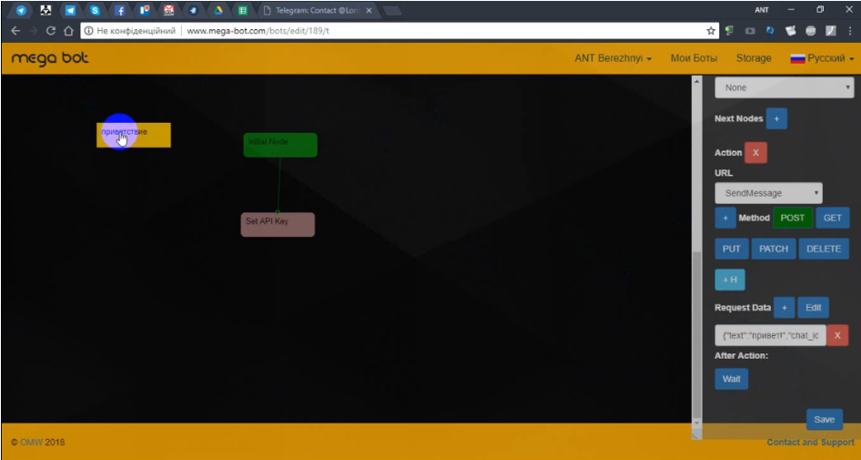

теперь нам нужно создать логический переход от узла Set API Key к  только что созданному нами узлу,
для этого перемещаем наш узел по центру ( Например сразу под  узел **Set API Key**). 

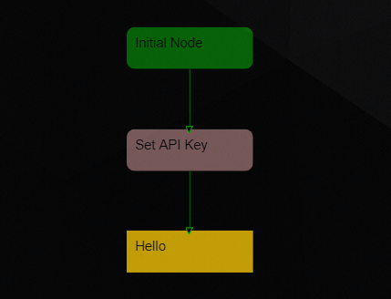

После чего кликаем один раз правой кнопкой мышки на узел **Set API Key**  
В модальном окне которое находится справа выбираем дефолтную ноду (пункт **Default Node**) и ее параметр `Hello`. Сохраняем! 

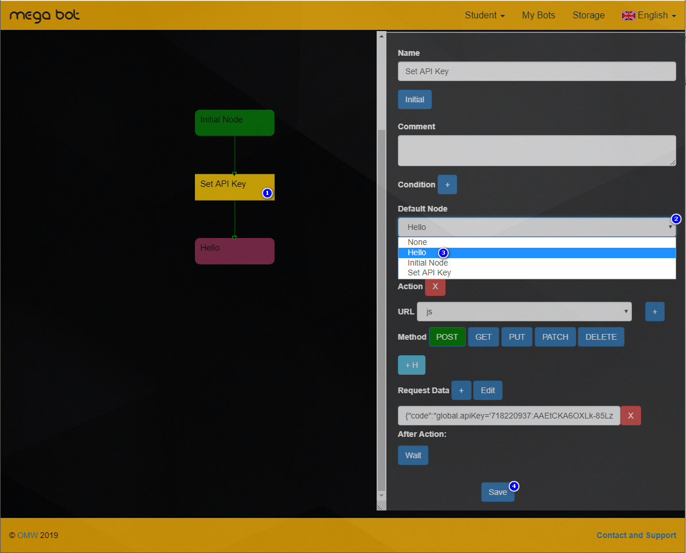

Дефолтная нода - это безусловный переход.
В нашем случае механика работы следующая:  бот получает сообщение и отвечает нам привет! 
( совпадение  А в)

-----
-----
-----
на даний момент в системе работают "живые логи", тоесть можна открыть консоль разработчика, и там посмотреть.
рекомендуем зразу передвинуть консоль для удобства в право.

открыть ее можна по **F12**, после чего ее лучше очистить

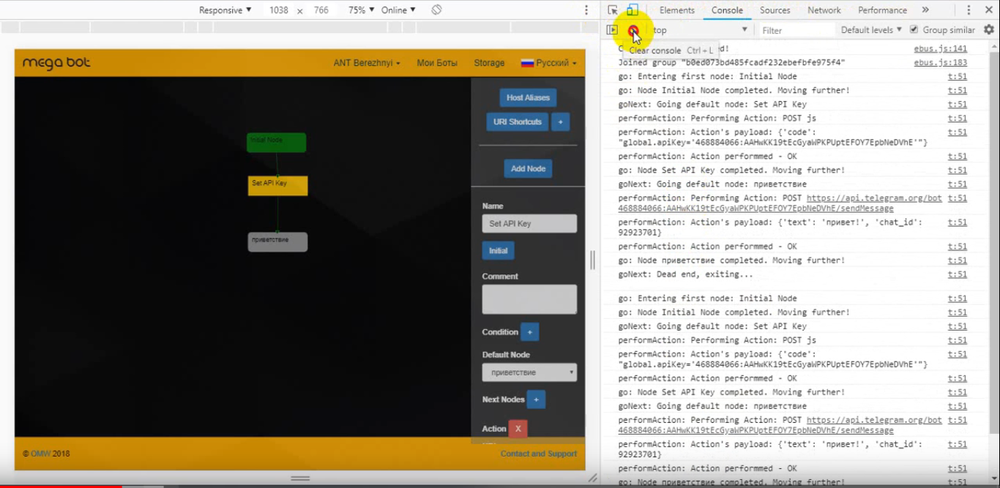

[video](https://www.youtube.com/watch?v=mWNeWhJe0gU&feature=youtu.be&t=12m21s){.youtube}
расшифровано ВСЕ до - 14:39 

-----
https://www.youtube.com/playlist?list=PLp6CsmZqbHvWxPY93rRAyiNSlBNBXJk34 

Video_2018-10-23_165518

Открываем браузер
http://www.mega-bot.com
авторизируемся 
L: student
P: student123

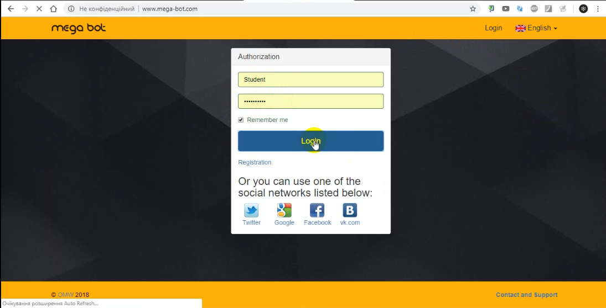

Переходим на вкладку мои боты 
http://www.mega-bot.com/bots 

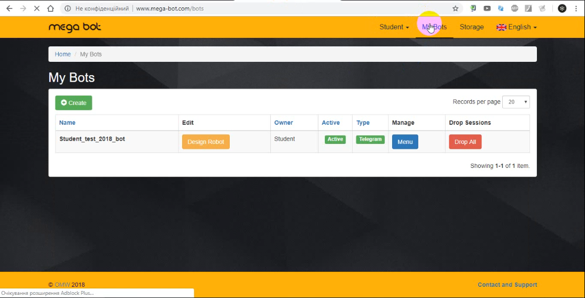

**Вызов окна редактора**

Чтобы начать быстрое редактирование параметров узла,  достаточно кликнуть  правой кнопкой мышки  на необходимом узле ( этим его выделив) -  цвет узла изменится на жёлтый

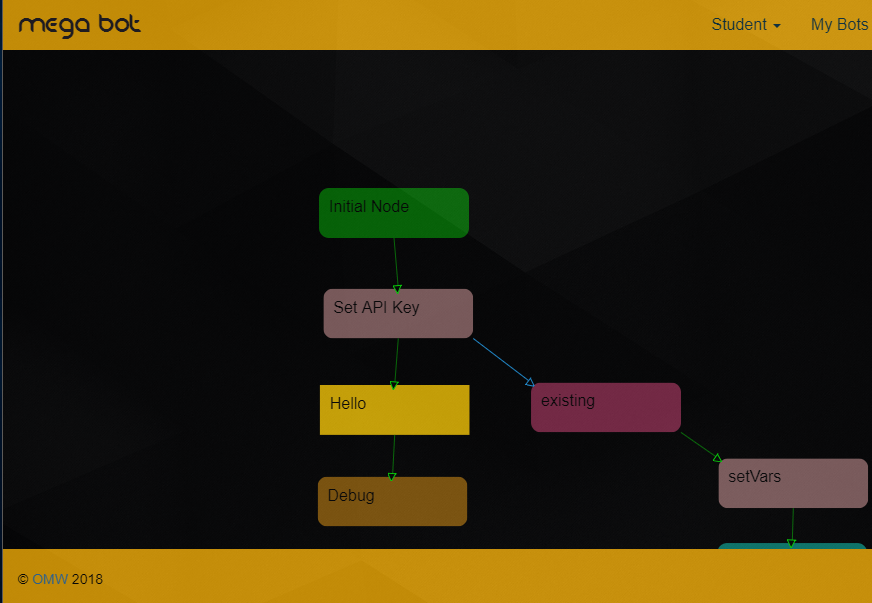

когда узел выбран, достаточно нажать <CTRL>+<E>, чтобы открылось окно с редактором.

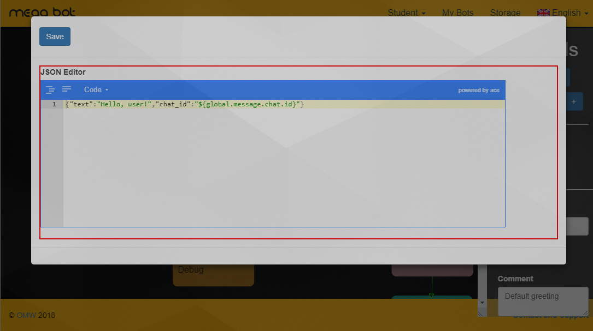 

После того как вы завершите редактирование,  нажмите кнопку **Cохранить** или  **Save** (находится в верхнем левом углу).

Если надобности в сохранении нет,  нажмите на клавиатуре клавишу **<Escape>**,  и модальное окно редактора закроется без сохранения изменений.

ручной запуск задачи для отладки схем. Кнопка **[Run Task]**

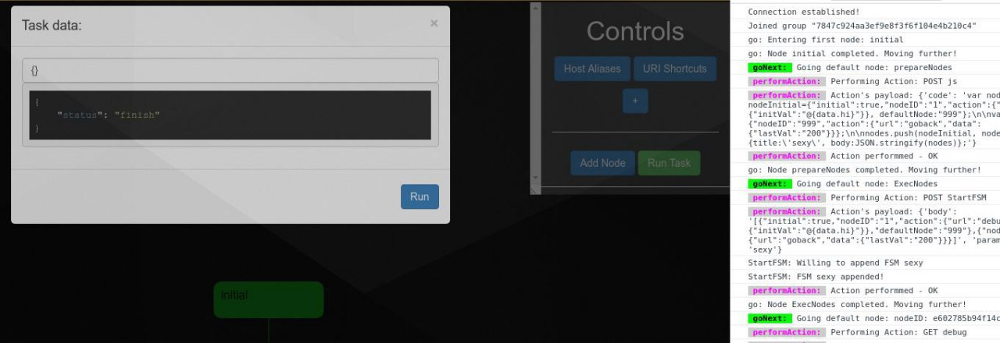

Для проверки этого функционала необходимо перейти к разделу  верхнего навигационного меню **боты** или в англоязычном интерфейсе **MyBots**

http://www.mega-bot.com/bots 


После чего в левой  верхней части окна нажать на Зеленую кнопку **[+Cоздать]** или в англоязычном интерфейсе  **[+Create]**

Или перейти по ссылке http://www.mega-bot.com/bots/create 

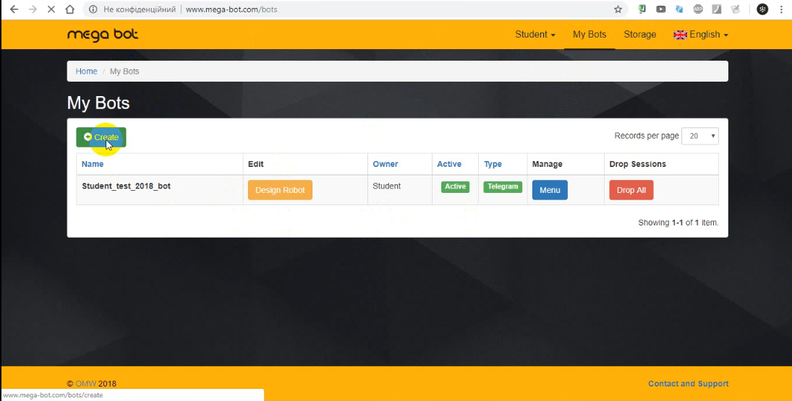

на странице которая открылась

задаем имя бота например **float**

Выбираем тип модуль **(Module)**

API Key для данного типа бота **(Module)** не нужен.  Поэтому поле API Key оставляем пустым. (написал issue)

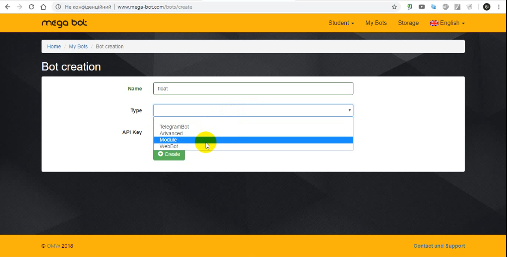

Внизу нажимаем зелёную кнопку **[+Cоздать]** или в англоязычном интерфейсе **[+Create]**

После создания бота, На странице http://www.mega-bot.com/bots/index  или http://www.mega-bot.com/bots 

Нажимаем на оранжевую кнопку **[Design Robot]**  - чтобы продолжить редактировать бота

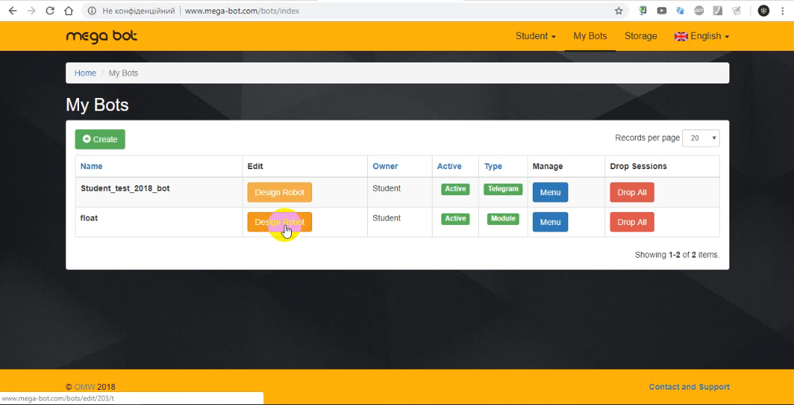

Происходит переход на страницу редактирования суббота

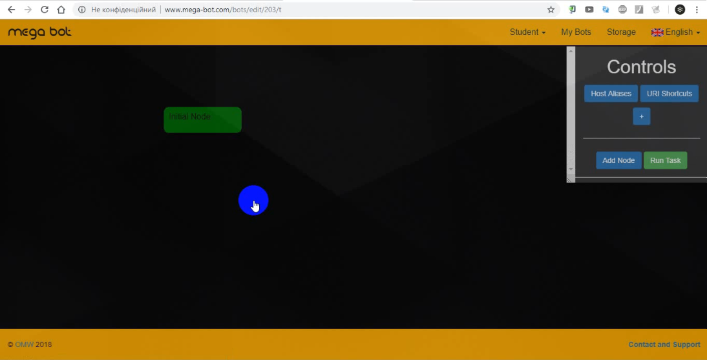

Для продолжения нужно нажать синюю  кнопку **[+]** на поле Controls правой части экрана

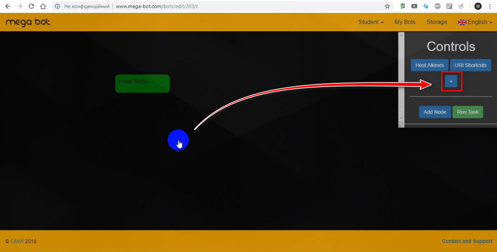

После чего нажать кнопку **[Restore] **

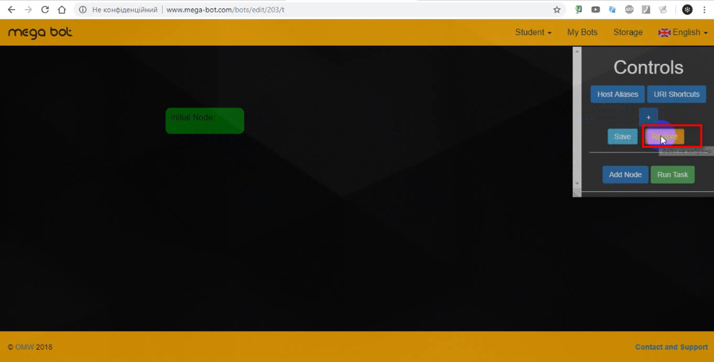

В диалоговом окне выбрать файл который будет содержать необходимые данные для Restore

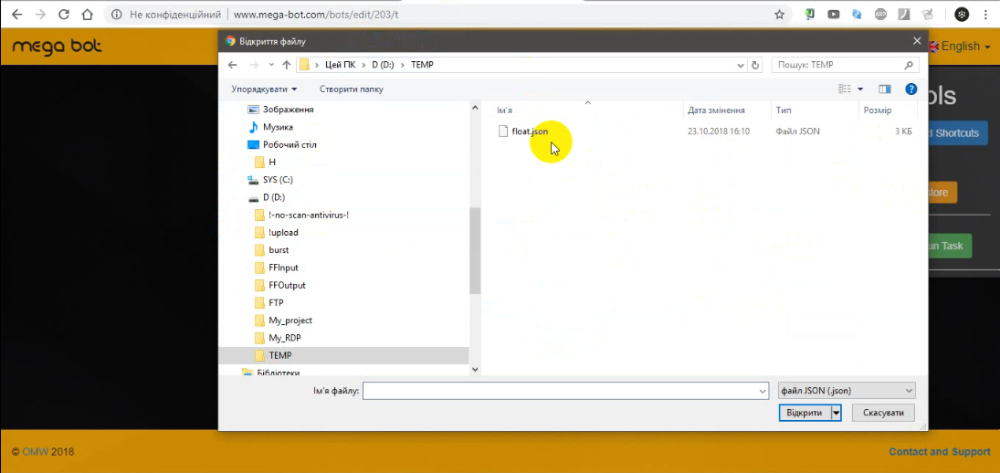

В нашем случае содержание файла float.json  приводится ниже:

```json
{"nodes":[{"action":{"headers":[],"url":"","method":"POST","delay":{"soft":"0","duration":"0","softrule":"long fast, short slow etc"}},"posY":"364","posX":"643","n_name":"initial","nodeID":"882140a416f14efea29d1fd9dfda6535","namespace":"float","initial":true,"defaultNode":"fc8333cbe56a4c95954ce03f5f970c1d","comment":""},{"defaultNode":"76ed704ee3db4ae1ba19bdeb652d7255","action":{"headers":[],"url":"aaf4da30-0cac-4b3a-af9b-a3d0bed1acca","method":"POST","data":{"code":"var nodes=[];\n//Обязательный узел входа\nvar nodeInitial={\"initial\":true,\"nodeID\":\"1\",\"action\":{\"url\":\"debug\",\"data\":{\"initVal\":\"{data.hi}\"}}, defaultNode:\"999\"};\n//Опциональный узел выхода \"goback\" для возвращения в нашу схему\nvar nodeLast={\"nodeID\":\"999\",\"action\":{\"url\":\"goback\",\"data\":{\"lastVal\":\"200\"}}};\n//Собираем узлы в список\nnodes.push(nodeInitial, nodeLast);\n//Обязательно экранируем переменные $\nglobal.inject={title:'sexy', body:JSON.stringify(nodes).replace(\"${\",\"@{\")};"}},"nodeID":"fc8333cbe56a4c95954ce03f5f970c1d","comment":"","n_name":"prepareNodes","posY":"468","posX":"643","namespace":"float"},{"defaultNode":"7feddbdd2cc8416f89fc7ae6fb0edc8c","action":{"headers":[],"url":"639f1050-2253-47b6-8a36-b91bae014b25","method":"POST","data":{"namespace":"${global.inject.title}","params":"${data}","body":"${global.inject.body}"}},"nodeID":"76ed704ee3db4ae1ba19bdeb652d7255","comment":"","n_name":"ExecNodes","posY":"558","posX":"643","namespace":"float"},{"defaultNode":"04fa54a49b6c48fb935f87b692b87b7b","action":{"headers":[],"url":"6048883a-9fee-4ba6-9d6f-e429f2196392","method":"POST"},"nodeID":"7feddbdd2cc8416f89fc7ae6fb0edc8c","comment":"","n_name":"finish","posY":"653.9174461364746","posX":"641.7523422241211","namespace":"float"},{"defaultNode":"","action":{"headers":[],"url":"84662d72-f07c-4b88-ba7b-631199d6dc87","method":"POST","data":{"json2":{"message":"${data}"}}},"nodeID":"04fa54a49b6c48fb935f87b692b87b7b","comment":"","n_name":"Report","posY":"731.2136325836182","posX":"641.6481781005859","namespace":"float"}],"namespace":"float"}
```

После Удачного прохождения Restore
браузер выдает уведомление

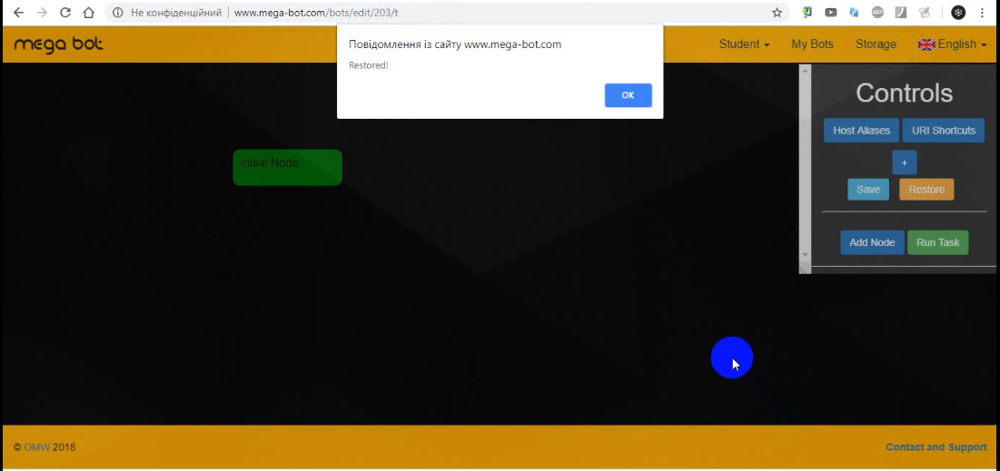

нажимаем кнопку **[OK]** 

После чего загружается обновлённая схема

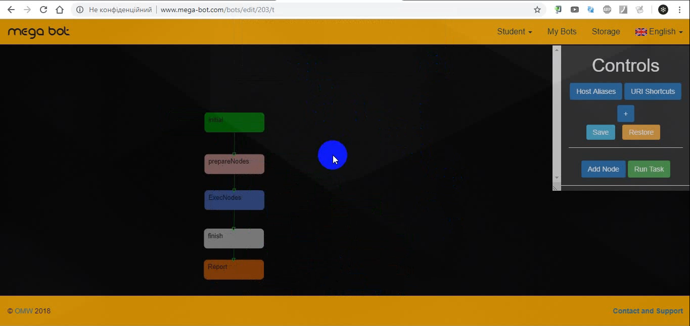

Для следующей работы необходимо открыть консоль браузера.  нажимаем  на клавиатуре **F12**

для запуска нужно нажать кнопку  **[Run Task]**

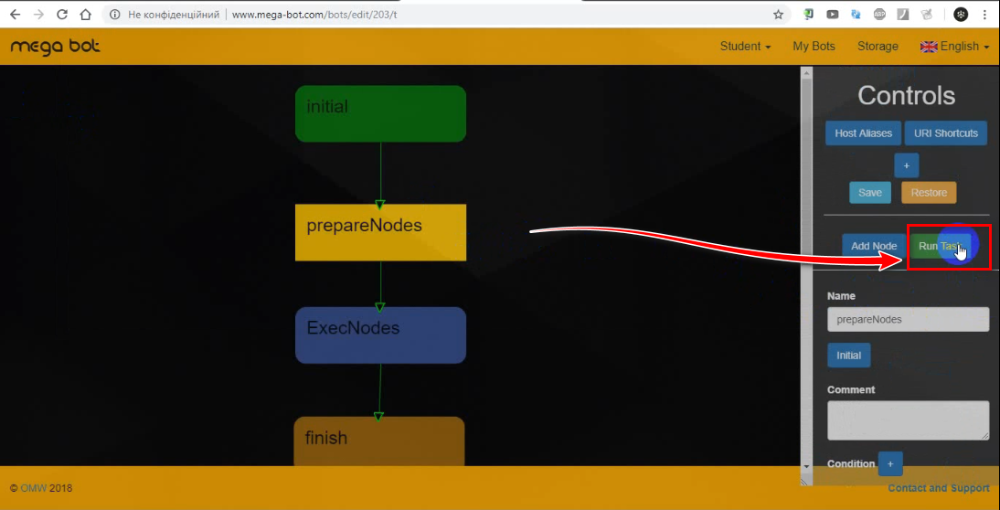

после чего, открывается модальное окно

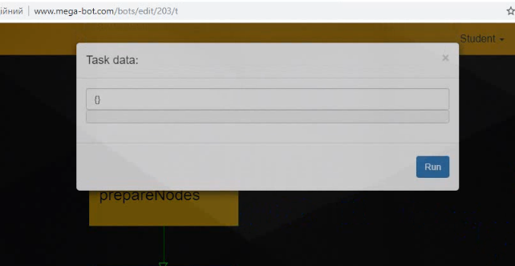

`{"hi":"me"}`


000
