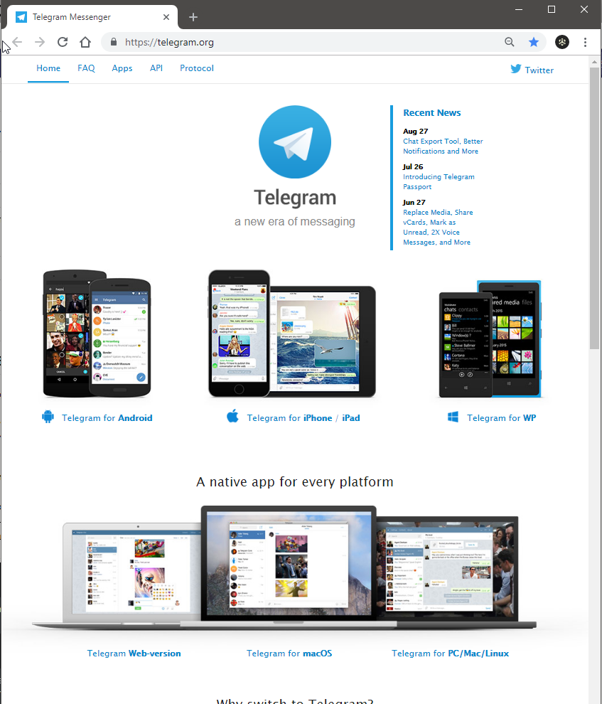
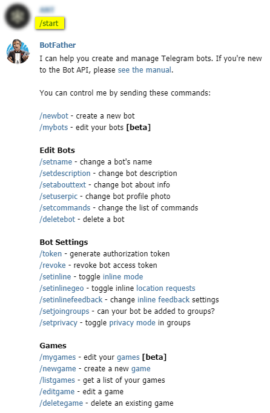
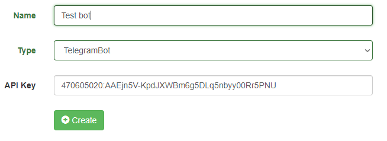
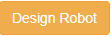
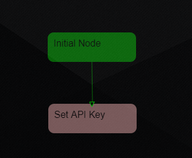

<!-- TITLE: Твой первый Телеграм бот -->
<!-- SUBTITLE: в этом разделе описано как зарегистрироватся и создать своего первого Телеграм бота. -->

<!--// це старий мануал який писав Влад, його треба вичитати, пофіксити старі картинки і додати нові //-->
<!--// ДЖЕРЕЛО https://gitlab.com/omw/megabot-web/wikis/home //-->

Как написать своего первого бота с помощью **MegaBot**?
-----
В этой статье описано, как сделать простенького бота для для [**Telegram**](https://telegram.org) с помощью нашего Web-сервиса под названием [**MegaBot**](http://www.mega-bot.com) 

# АККАУНТ В ТЕЛЕГРАМ
Для начала у нужно иметь аккаунт в Телеграме.

Если его еще нет, то создать его можна тут: [https://telegram.org](https://telegram.org) 

...тоесть качаем клиента на свое устройство, инсталируем и конечно регистрируемся...
<!-- зробити ПОТІМ розділи для "чайників" як виконати кожну з цих дій, а коли буде свій канал на Ютубі, то можна зняти і відео, ще й пошукового трафіка можна буде підняти на цьому -->

...дальше пользуемся клиентом, или web-версией [https://web.telegram.org/#/im](https://web.telegram.org/#/im)

# РЕГИСТРАЦИЯ БОТА  

Для начала нужно прийти к специальному боту, который дает возможность создавать новых ботов [BotFather](https://t.me/BotFather) 
Вот его постоянный адрес который можна запомнить: [https://t.me/BotFather](https://t.me/BotFather) 
BotFather - на данный момент разговаривает только на английском, возможно в будущем, будет локализация и для других языков. 

Нажимаем `Start` или пишем `/start` (в примере на картинке тут и дальше - желтым)

Из большого списка команд выбираем `/newbot` (первая из команд)

В ответ [BotFather](https://t.me/BotFather) пишет:

>  Alright, a new bot. How are we going to call it? Please choose a name for your bot. 
>  
>  Хорошо, новый бот. Как мы будем называть это? Пожалуйста, выберите имя для своего бота.

Даем ему имя [в примере желтым]

В ответ [BotFather](https://t.me/BotFather) пишет:

>  Good. Now let's choose a username for your bot. It must end in `bot`. Like this, for example: TetrisBot or tetris_bot.
>  
>  Хорошо. Теперь давайте выберем юзернейм для вашего бота. Он должен заканчиваться `bot`. Например, это: TetrisBot или tetris_bot.

Придумываем нашему боту юзернейм (обязательно, чтобы он оканчивался на `bot`)

В ответ [BotFather](https://t.me/BotFather) пишет:

>  Done! Congratulations on your new bot. You will find it at t.me/You12345Bot . You can now add a description, about section and profile picture for your bot, see /help for a list of commands. By the way, when you've finished creating your cool bot, ping our Bot Support if you want a better username for it. Just make sure the bot is fully operational before you do this.
>  
>  Готово! Поздравляем с новым ботом. Вы найдете его в t.me/You12345Bot . Теперь вы можете добавить описание, описание раздела и профиля для своего бота, см. /help для списка команд. Кстати, когда вы закончили создание своего крутого бота, пингоните нашу поддержку, если конечно вы хотите получить лучшее имя пользователя. Но сначала убедитесь, что бот полностью работоспособен, прежде чем вы это сделаете.

<!--// #################################### ВИЧИТАНО ДО ЦЬОГО МІСЦЯ ########################################### //-->

Итак [BotFather](https://t.me/BotFather) выдал нашему боту имя/адрес (желтым) и токен (розовым).

Настоятельно советуем сохранить Token в надёжном месте (он нам дальше понадобится) и не давайте его посторонним людям (потому что они могут сломать вашего бота).

Так же, как мы видим ниже под токеном, [BotFather](https://t.me/BotFather) настоятельно рекомендует прочитать и мануалы

>  For a description of the Bot API, see this page: 
>  
>  Описание API-интерфейса Bot см. На этой странице:

https://core.telegram.org/bots/api

Мы же рекомендуем пойти еще дальше, и добавить их в закладки браузера )))

-----
# Создание бота на MegaBot

1.Заходим на сайт [MegaBot`a](http://www.mega-bot.com).  
2.Нажимаем на кнопку  и заходим с помощью любого из предложенных способов.  
3.Теперь нажимаем .  
4.Даём ему имя(оно будет отображаться только на сайте),выбираем тип "TelegramBot".  
5.В строку *API Key* вставляем токен который мы получили выше от "Папы-бота". 

6.Нажимаем   
7.Поздравляю,вы создали и сразу же захостили бота.  
Создание функционала бота.

-----

1.После того как вы создали бота,нажимаете  и попадаете в "реактор",где собственно и происходит создание всего функционала бота,двигаются узлы "древа" с помощью левой кнопки мыши,выбирается нужный узел с помощью правой кнопки мыши.  
2.Перед собой вы видите 2 основных узла , с "Initial Node" начинается сам бот,в "Set API Key" , лежит тот самый Token который мы ввели выше.  
3.Создадим новый узел.В панели "Controls" жмем кнопку  ,даём узлу имя(у меня это будет "start") и жмём внизу .  
4.На рабочем поле появился узел с именем которое мы ему дали,выбираем его и устанавливаем для него условия входа(Condition).  
5.Нажимаем  возле слова "Сondition".  
6.Появилась пустая строка    , в неё запишем `{"message":{"text":"/start"}}` (Отдельно рассмотрим Condition ниже).   
7.Теперь у нас есть узел с условием.Условие этого узла примерно означает:"Если сообщение содержит текст,а именно `/start`,то узел "пропускает" вас дальше".   
8.Теперь о входе в узел,чтобы попасть в наш новый узел,выбираем узел "Set API Key",видим там ,нажимаем плюс и в появившуюся строку вводим "start".   
9.Теперь об этом самом "пропуске".Узел может "пропустить" вас в нескольких направлениях(в нашем случае будет 1 направление).Сначала создадим новый узел и назовем его "Hello".Вернёмся к предыдущему узлу,чтобы сделать переход от него к узлу "Hello".Переход делается также как и в пункте выше(через "NextNodes").
10.Action-это действие,которое будет выполнено при переходе в текущие узел.Существует 2 типа действий:   
1-Выполнение http-вызова к произвольному RESTful API,который возвращает "Content-Type: application/json".   
2-Использование внутренних методов,которые расширяют внутренний функционал нашей системы.   

# Условия входа в узел(Conditions)
Условия записываются в формате [JSON](https://ru.wikipedia.org/wiki/JSON).   
Всё что нужно для вашего JSON вы найдёте в [Telegram Bot API](https://core.telegram.org/bots/api).